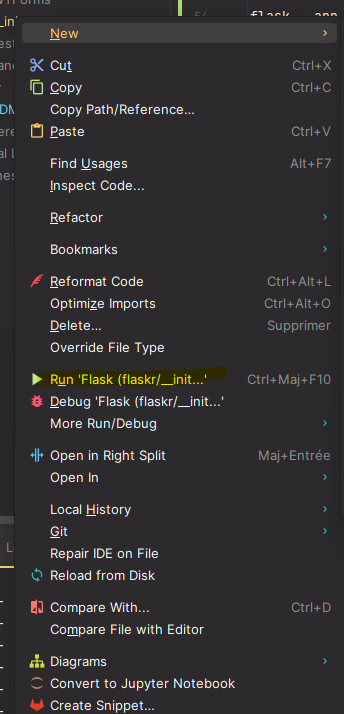
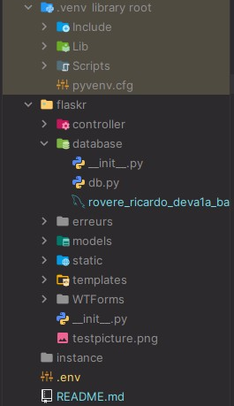
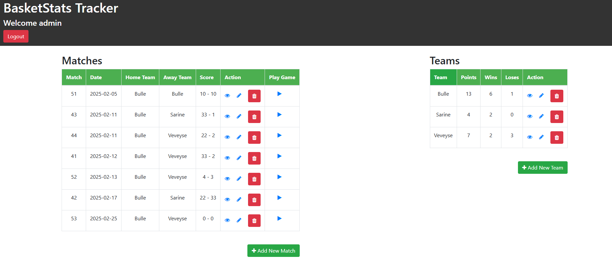
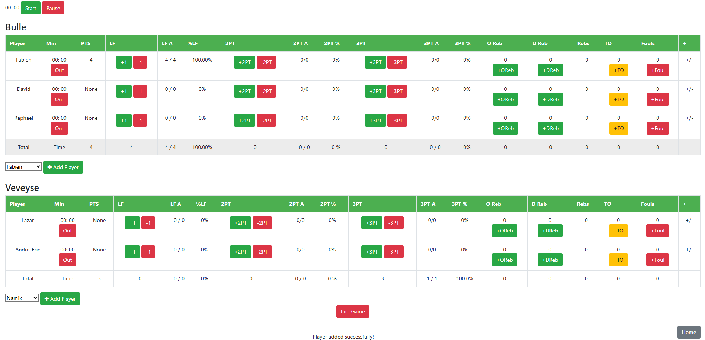
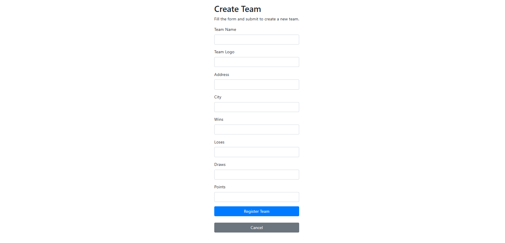
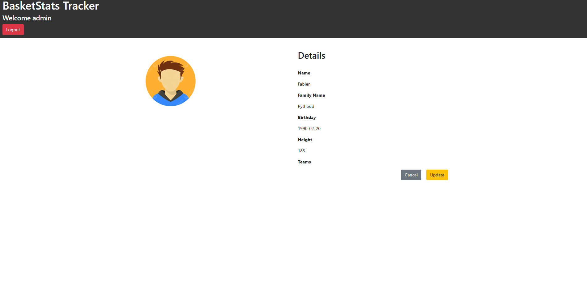
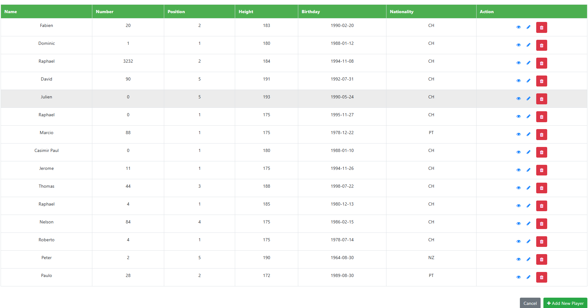

# Basket Stats

### Cahier des charges
[PDF Cahier des charges](Rovere_Paulo_DEVA1A_Cahier_Charges.pdf)

## Description du projet
Mon projet est de développer une application de statistiques de basketball qui permet aux entraîneurs de gérer leurs
équipes et joueurs, de créer des matchs, et de suivre les performances des joueurs à travers
des statistiques comme les points, les rebonds, les passes décisives, etc. L'objectif est de centraliser
ces données afin d'y accéder rapidement et de les analyser efficacement.


## Technologie utilisée
- Flask 
- Python 
- Bootstrap 
- Pycharm 

### Install Requirements
```text
pip install -r requirements.txt
```

### Lancer
```text
Vous pouvez lancer l'application en tapant : 
flask --app flaskr run 
depuis le dossier flaskr.
```

ou

```text
Cliquez droit sur le fichier run_app.py et choisissez Exécuter [CTRL+SHIFT+F10]
```


### APP Connexion administrateur 
```text
Username: admin
password: admin
```


## Installation
### Cloner le dépôt
```python
https://github.com/RovereRicardo/Rovere_Ricardo_DEVA1A_2025_164.git
```
### Installer Python 
```python
Téléchargez depuis le site officiel : https://www.python.org/downloads/windows/
Après installation, dans la ligne de commande tapez : "python -V"
Cette commande vous indiquera si Python est bien installé.

```

### Installer pip
```python
py get-pip.py 
```
Lancer en mode debug :
```python
Quand tout est installé, ouvrez le dépôt et tapez dans le terminal : 
flask --app flaskr --debug run
```
Lancer sans mode debug :
```python
flask --app flaskr run
```

## Comment lancer l'application
```text
Si vous souhaitez modifier l'hôte, l'utilisateur ou le mot de passe : 
Allez dans le fichier .env et changez les identifiants que vous voulez.
```


### Lancer
```text
Vous pouvez lancer l'application en tapant : 
flask --app flaskr run 
depuis le dossier flaskr.
```

ou

```text
Cliquez droit sur le fichier run_app.py et choisissez Exécuter [CTRL+SHIFT+F10]
```


### APP Connexion administrateur 
```text
Username: admin
password: admin
```

### APP Connexion Coaches
```text
Bulle :
username: bulle
password: bullebasket

Sarine:
username: sarine
password: sarinebasket

Veveyse:
username: veveyse
password: veveysebasket

Villars:
username: villars
password: villarsbasket

Payerne:
username: payerne
password: payernebasket

Fribourg:
username: fribourg
password: fribourgbasket

Courtepin:
username: courtepin
password: courtepinbasket

Marly:
username: marly
password: marlybasket

```

## Structure de l'application Flask 
```
.
|───────Project
|────────README.md
|────────Rovere_Paulo_DEVA1A_Cahier_Charges.pdf
|────────run_app.py
|──────flaskr/
| |────controller/
| | |────matchs.py
| | |────players.py
| | |────stats.py
| | |────teams.py
| | |────user.py
| |────database/
| | |────__init__.py
| | |────db.py
| | |────rovere_ricardo_deva1a_basketstats_164_2025.sql
| |────Doc/
| | |────Files for the DOC
| |────models/
| | |────matchs.py
| | |────players.py
| | |────stats.py
| | |────teams.py
| | |────total.py
| | |────user.py
| |────static/
| |────bootstrap.bundle.min.js
| |────bootstrap.min.css
| | |────css/
| | | |────all.css
| | | |────brands.css
| | | |────fontawesome.css
| | | |────regular.css
| | | |────solid.css
| | | |────svg-with-js.css
| | | |────v4-font-face.css
| | | |────v4-shims.css
| | | |────v5-font-face.css
| | |────font-awesome-4.7.0/
| | |────webfonts/
| | |────user.py
| |────templates/
| | |────base.html
| | |────index.html
| | |────auth/
| | | |────login.html
| | | |────register.html
| | |────macros/
| | | |────forms.html
| | |────matchs/
| | | |────_match_table.html
| | | |────_scoresheet.html
| | | |────edit_match.html
| | | |────matches.html
| | | |────register_match.html
| | | |────scoresheet.html
| | | |────view_match.html
| | |────players/
| | | |────_graph.html
| | | |────players.html
| | | |────register_player.html
| | | |────update_player.html
| | | |────view_player.html
| | |────teams/
| | | |────ranking.html
| | | |────register_team.html
| | | |────team_details.html
| | | |────teams.html
| | | |────update_team.html
| | | |────view_team.html
| | |────WTForms/
| | | |────Forms.py
|──────__init__.py
|──────.env

```
## Configuration Flask
```python
def create_app():
    app = Flask(__name__)
    app.config.from_mapping(
        SECRET_KEY='dev',
        DATABASE=connection,
    )
```

## Visuels
### Homepage


### Match


### Create


### View


### TeamView


## Contributions
### 👩‍💻 Ricardo Rovere

[ ](https://github.com/RovereRicardo)
[](Link)

